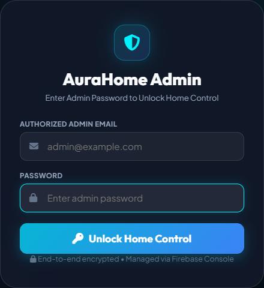
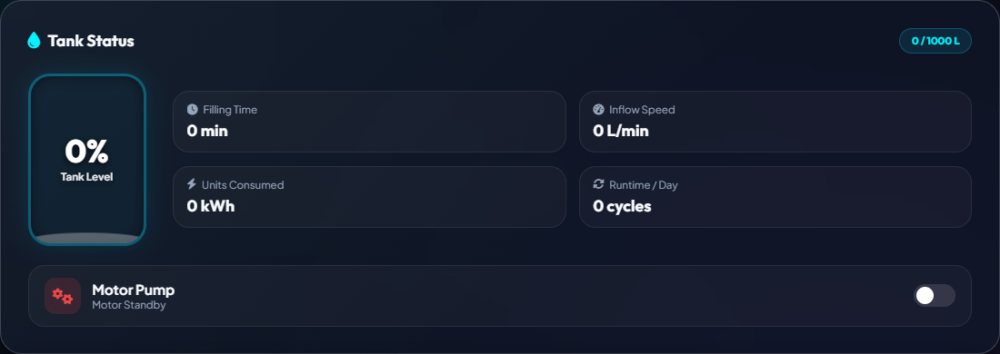
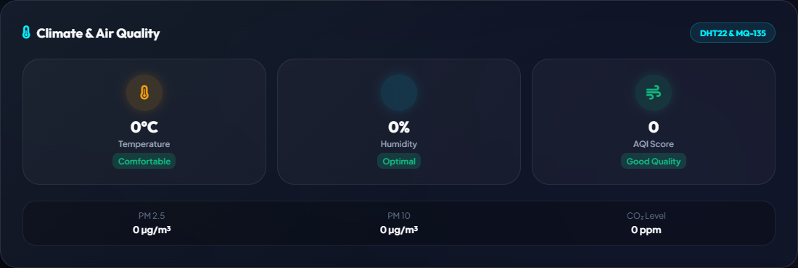
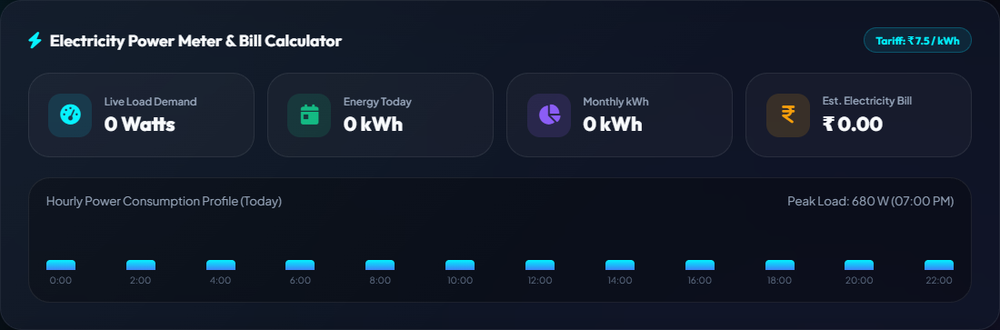
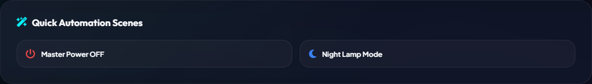
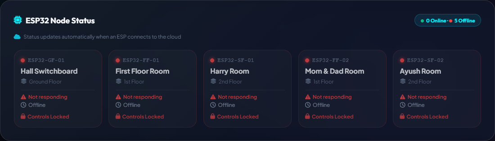

# ⚡ Electrofic — Smart Home Automation & IoT Ecosystem

[](https://electrofic-homeautomation.web.app/)
[](https://reactjs.org/)
[](https://www.raspberrypi.org/)
[](https://www.espressif.com/)
[](https://github.com/Ayush-kaithwas/Electrofic-Home-Automation/actions)

**Electrofic** is a modern, real-time Smart Home Automation system featuring a progressive web app (PWA) dashboard, multi-floor switchboard control, IoT sensor telemetry, smart water tank monitoring, and an intelligent Raspberry Pi gateway bridging ESP32 hardware nodes directly with Firebase Realtime Database.


## 🌟 Visual Feature Tour

Welcome to the Electrofic Home Automation dashboard! This interface was designed to be incredibly easy to use, even if you have no technical background. Here is a quick tour of what you can do:

### 🔒 Secure Admin Login
Before anyone can control your home, they must enter the secure Admin Password. This ensures that only you and your family have access to your appliances.
<br>


### 🎛️ Multi-Floor Switchboards
This is the heart of the home automation. Each room in your house has its own "Switchboard" card. You can click on any appliance (like a Fan, Light, or Chandelier) to instantly turn it on or off. For fans, there is also a regulator slider to adjust the speed perfectly.

### 💧 Smart Water Monitoring & Pump Automation
Never run out of water again! This widget gives you a live, animated view of exactly how much water is inside your rooftop tank. It tracks the volume in Litres, the fill percentage, and even estimates how many minutes it will take to fill up completely. You can turn the water pump ON/OFF directly from here.
<br>


### 🌡️ Climate, Environment & Air Quality
Curious about the weather inside your house? This widget pulls data from real hardware sensors to show you the live Room Temperature, Humidity, and the overall Air Quality Index (AQI) so you can ensure your family is breathing healthy air.
<br>


### ⚡ Live Electricity Analytics
Keep an eye on your electricity bill before it arrives! The system tracks exactly how much power your appliances are actively drawing in Watts. It calculates your daily and monthly usage (kWh) and estimates your real-time electricity cost based on your local tariff rates.
<br>


### 🪄 Quick Automation Scenes
Don't want to turn off 15 lights one by one before bed? Automation scenes are magic buttons that trigger multiple actions at once. For example, hitting "Master Power OFF" will instantly shut down every single appliance in the entire house, while "Night Lamp Mode" will turn off all main lights and turn on the soft night bulbs.
<br>


### 🛡️ ESP32 Hardware Node Status
Behind the scenes, your house is powered by tiny microchips called ESP32s hidden inside your walls. This widget acts as a health monitor for your smart home. It shows you exactly which chips are currently online, their secure MAC addresses, and which appliances are active.
<br>


### 📱 Modern Progressive Web App (PWA)
- **Glassmorphic UI**: Cyber-luminescent dark theme with smooth micro-animations and typography.
- **Optimistic UI Locking**: Eliminates state-bounce glitches caused by telemetry delays for instantaneous user feedback.
- **Real-time Sync**: Direct Firebase Realtime Database integration for instant synchronization across devices.
- **Installable PWA**: Works seamlessly on mobile (iOS/Android) and desktop with offline service worker support.

### 🛡️ Distributed Systems Resilience
- **Gateway LWT (Last Will & Testament)**: The RPi emits a background heartbeat (`gateway_last_seen`). If it crashes, the React UI detects the timeout (45s) and automatically globally locks the interface to prevent stale data.
- **Asynchronous Cloud Sync**: The Python bridge utilizes a `ThreadPoolExecutor` to completely decouple blocking Firebase REST calls from the core MQTT event loop, ensuring zero latency on local networks even during internet outages.
- **Deterministic Hardware Addressing**: ESP32 nodes dynamically register themselves via fixed hardware MAC addresses rather than transient local IPs, guaranteeing zero-config stability across router reboots.

### 🔄 Automated CI/CD
- Built-in GitHub Actions workflow auto-deploys every commit merged into `main` directly to **Firebase Hosting**.

---

## 🏗️ Architecture Overview

```
 ┌─────────────────────────────────────────────────────────────┐
 │                  ESP32 Microcontroller Node                 │
 │  - Relays (Lights, Fans, Chandelier, Sockets)               │
 │  - Environmental Sensors (Temp, Humidity, Water)            │
 └──────────────────────────────┬──────────────────────────────┘
                                │ (Local MQTT Topics)
                                ▼
 ┌─────────────────────────────────────────────────────────────┐
 │                  Raspberry Pi Master Hub                    │
 │  - Mosquitto MQTT Broker (Port 1883)                        │
 │  - Python Gateway Bridge (`bridge.py`)                      │
 └──────────────────────────────┬──────────────────────────────┘
                                │ (Firebase Admin SDK / WebSockets)
                                ▼
 ┌─────────────────────────────────────────────────────────────┐
 │              Firebase Realtime Cloud Database               │
 │          (Live State Sync & Command Dispatching)            │
 └──────────────────────────────┬──────────────────────────────┘
                                │ (Firebase Web SDK / HTTPS)
                                ▼
 ┌─────────────────────────────────────────────────────────────┐
 │              Electrofic React PWA Dashboard                 │
 │            (Hosted live on Firebase Hosting)                │
 └─────────────────────────────────────────────────────────────┘
```

---

## 📁 Repository Structure

```
.
├── .github/workflows/       # GitHub Actions CI/CD (Auto-deploys to Firebase Hosting)
├── docs/                    # Hardware wiring guides & Raspberry Pi setup documentation
├── esp32-nodes/             # Arduino / C++ firmware for ESP32 relay modules
├── raspberry-pi/            # Python gateway daemon, bridge script & systemd service
├── web-dashboard/           # React 18 PWA Web Dashboard (HTML, CSS, JS, Assets)
└── .gitignore               # Excludes secrets (serviceAccountKey.json, .env) and node_modules
```

---

## 🚀 Getting Started

### 1. Web Dashboard (Local Development)
```bash
cd web-dashboard
# Run local preview server
python serve-app.py
```
Open `http://localhost:8080` in your browser.

### 2. Raspberry Pi Gateway
```bash
cd raspberry-pi
pip3 install -r requirements.txt
python3 bridge.py
```

### 3. Flash ESP32 Firmware
1. Open `esp32-nodes/esp32_relay_switch/esp32_relay_switch.ino` in Arduino IDE.
2. Enter your Wi-Fi credentials and Raspberry Pi IP address.
3. Upload to your ESP32 board.

---

## 🔄 Automatic Deployment

Any push to the `main` branch automatically triggers the GitHub Actions workflow to build and deploy the dashboard live to:
👉 **[https://electrofic-homeautomation.web.app/](https://electrofic-homeautomation.web.app/)**

---

## 📄 License
This project is open-source under the [MIT License](LICENSE).
